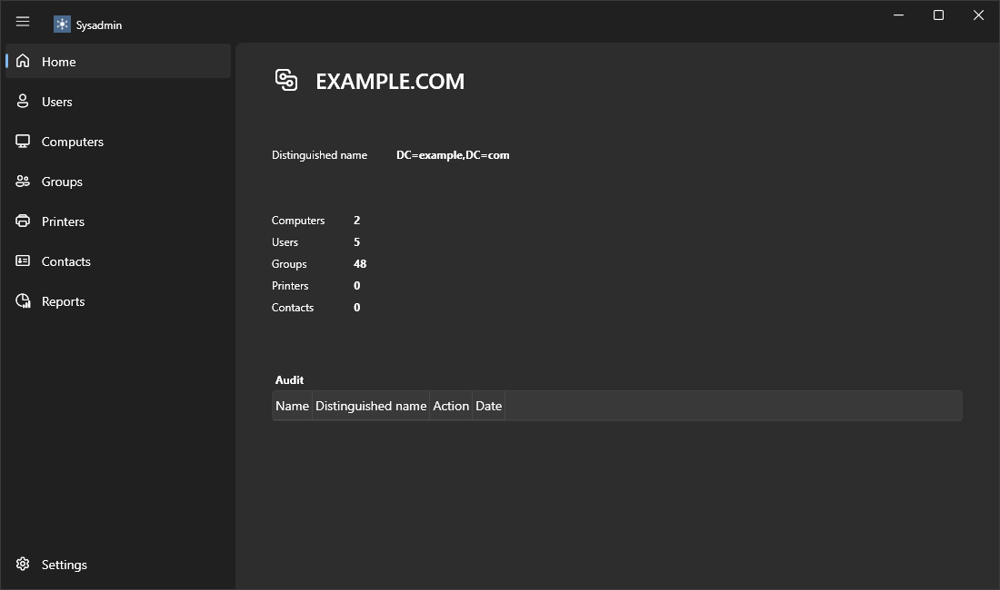

### Sysadmin

Sysadmin makes easier to administer multidomain Active Directory-based networks by providing a single tool to do whatever you need - use it to manage domains, servers, computers, users, and groups.

### Features

- Add, edit and delete objects in Active Directory
- View software and hardware
- Events, processes, services on computers
- Add and delete objects from groups
- Reset a user's password
- Add photos
- Restart and shutdown remote computers
- Computers performance
- Patterns for add new users
- Reports (20+)
- No limitation on the number of objects

### Download

[Latest releases](https://github.com/sysadminanywhere/sysadmin/releases)

### License

This software is distributed under the terms of the MIT License (MIT).

### Authors

Igor Markin / [LinkedIn](https://www.linkedin.com/in/igor-markin/)

Contributions and bugs reports are welcome.
