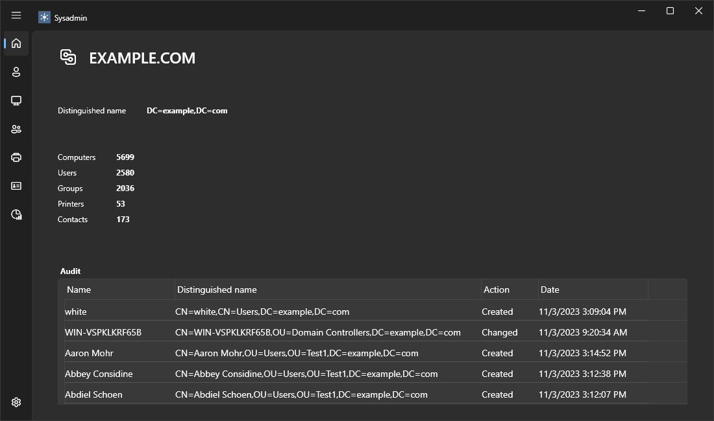

### Sysadmin

Sysadmin makes easier to administer multidomain Active Directory-based networks by providing a single tool to do whatever you need - use it to manage domains, servers, computers, users, and groups.

### Download

### License

This software is distributed under the terms of the MIT License (MIT).

### Authors

Igor Markin / [LinkedIn](https://www.linkedin.com/in/igor-markin/)

Contributions and bugs reports are welcome.